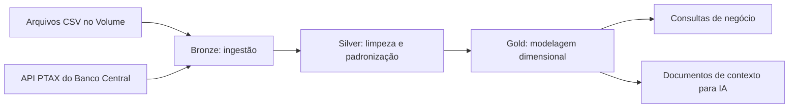
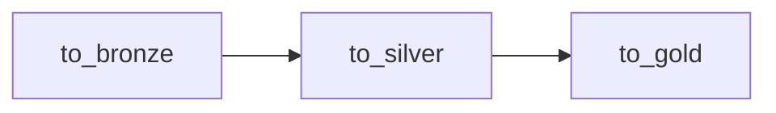

# CineData Analytics

Pipeline de engenharia de dados desenvolvido para o Rocket Lab 2026.2, utilizando Databricks, PySpark e Delta Lake. O projeto transforma dados de filmes das bases TMDB/IMDb em tabelas analíticas para BI e em documentos de contexto para uma aplicação de inteligência artificial.

## Objetivo

Organizar e tratar um catálogo de filmes com informações descritivas, financeiras, avaliações, gêneros, participantes e produtoras. A solução segue a arquitetura Medalhão, separando ingestão, tratamento e disponibilização dos dados nas camadas Bronze, Silver e Gold.

A cotação do dólar é obtida pela API PTAX do Banco Central do Brasil e utilizada para apresentar valores financeiros também em reais.

## Tecnologias

- Databricks para execução dos notebooks e orquestração do pipeline.
- Python e PySpark para ingestão, limpeza e transformação dos dados.
- Spark SQL para operações de catálogo e consultas auxiliares.
- Delta Lake para armazenamento das tabelas.
- API PTAX do Banco Central para obtenção de cotações USD/BRL.
- GitHub para versionamento e disponibilização dos arquivos do projeto.

## Arquitetura

As tabelas são organizadas no catálogo `medallion`, nos schemas `bronze`, `silver` e `gold`.

## Arquivos do projeto

| Arquivo | Responsabilidade |
|---|---|
| `Landing_to_Bronze.ipynb` | Preparação do ambiente e ingestão dos CSVs e das cotações. |
| `Bronze_to_Silver.ipynb` | Limpeza, conversão de tipos, padronização e consolidação dos dados. |
| `Silver_to_Gold.ipynb` | Criação das dimensões, pontes, fato, contexto para IA e consultas de negócio. |
| `job.yaml` | Configuração exportada do Job, incluindo tarefas, dependências e agendamento. |

## Fontes de dados

Os arquivos de entrada são disponibilizados em um Volume do Databricks:

| Arquivo | Tabela Bronze |
|---|---|
| `movies_info_IMDB_TMDB.csv` | `medallion.bronze.tb_movies_info` |
| `movies_financials_IMDB_TMDB.csv` | `medallion.bronze.tb_movies_financials` |
| `movies_metrics_IMDB_TMDB.csv` | `medallion.bronze.tb_movies_metrics` |
| `credits_and_tags_IMDB_TMDB.csv` | `medallion.bronze.tb_credits_and_tags` |
| `movies_reviews.csv` | `medallion.bronze.tb_movies_reviews` |
| API PTAX | `medallion.bronze.tb_cotacao_dolar` |

A ingestão da API recebe as datas `data_inicio` e `data_fim` por widgets, no formato `YYYY-MM-DD`, convertendo-as para o formato esperado pelo serviço.

## Camada Bronze

A Bronze recebe os dados de origem e adiciona `ingestion_datetime` para registrar o momento da ingestão. As tabelas são gravadas em formato Delta e servem como origem para a Silver.

O notebook de ingestão também contém a preparação do ambiente necessária ao projeto. Os caminhos do Volume e as permissões do catálogo devem estar configurados antes da execução.

## Camada Silver

| Tabela | Principais tratamentos |
|---|---|
| `tb_info_filmes` | Renomeação de colunas, normalização e tradução de status, conversão de datas em múltiplos formatos, duração numérica e criação do ano de lançamento. |
| `tb_financeiro_filmes` | Conversão monetária, interpretação de K/M/B, deduplicação, conversão USD/BRL e cálculo de lucro e percentual de retorno. |
| `tb_metricas_engajamento` | Conversão segura de popularidade, notas e votos; validação de escala e tratamento de valores negativos. |
| `tb_avaliacoes_usuarios` | Remoção de avaliações originalmente duplicadas, validação de notas e preenchimento de comentários ausentes. |
| `tb_generos` | Separação de múltiplos gêneros, validação do domínio e deduplicação das relações com filmes. |
| `tb_pessoas_empresas` | Consolidação de atores, diretores, roteiristas e produtoras, padronização de nomes e remoção de resíduos. |
| `tb_cotacao_dolar` | Consolidação diária das cotações e preenchimento dos dias sem publicação. |

Todas as tabelas acima pertencem a `medallion.silver`.

### Regras de tratamento

- **Filmes:** a versão mais recente é priorizada pela data de ingestão. Em empate, utiliza-se a quantidade de atributos preenchidos.
- **Status:** o texto é normalizado antes da tradução. Valores não reconhecidos recebem `Não Informado`.
- **Datas:** os formatos são testados em sequência; datas ambíguas seguem a prioridade definida no código.
- **Financeiro:** K, M e B representam mil, milhão e bilhão. Orçamento e receita não positivos são tratados como ausentes. A regra de extração remove vírgulas e utiliza a primeira ocorrência numérica.
- **Deduplicação financeira:** prioriza ingestão, preenchimento das métricas e hash dos valores originais como desempate.
- **Lucro:** calculado como receita menos orçamento. Se faltar uma parcela, o resultado permanece nulo.
- **Percentual financeiro:** a coluna `margem_lucro_percentual` calcula `(receita - orçamento) / orçamento × 100`. Apesar do nome mantido no código, a medida representa retorno sobre o orçamento, e não margem sobre a receita.
- **Notas:** somente valores de 0 a 10 são aceitos. Contagens negativas são invalidadas.
- **Avaliações:** a deduplicação ocorre nos campos originais de filme, usuário, nota e comentário, antes da normalização. Comentários ausentes recebem `Sem comentário`.
- **Entidades:** vírgula, ponto e vírgula e barra vertical são tratados como separadores. São removidos vazios, marcadores de ausência, números identificados pelo padrão de limpeza, caminhos de imagem e textos com mais de 100 caracteres.

### Cotação e intervalo de datas

O calendário da Silver considera a data de execução no fuso `America/Recife`, iniciando **sete dias antes de hoje e terminando hoje**, com ambos os limites incluídos. Por exemplo, uma execução no dia 20 contempla os dias 13 a 20, totalizando oito datas.

Para cada dia, mantém-se a publicação mais recente disponível. Dias sem publicação recebem a última cotação anterior conhecida por meio de *forward fill*.

A Bronze precisa conter uma cotação anterior ao início do intervalo quando o primeiro dia não tiver publicação. Uma janela de consulta maior ajuda a obter essa cobertura, mas não a garante em qualquer calendário. Caso falte uma taxa inicial, é necessário ampliar a consulta da API e executar a ingestão novamente.

A conversão financeira utiliza a cotação mais recente disponível na Bronze; não representa a cotação histórica da data de lançamento de cada filme.

## Camada Gold

A Gold organiza os dados em um modelo dimensional com uma fato central e tabelas ponte para relações de muitos para muitos.

| Tabela | Grão ou finalidade |
|---|---|
| `dim_movies` | Um registro por filme, com seus atributos descritivos. |
| `dim_genres` | Um registro por gênero. |
| `dim_people` | Um registro por combinação de nome e tipo de atuação. |
| `dim_companies` | Um registro por nome de produtora. |
| `dim_reviews` | Um resumo de avaliações por filme que recebeu avaliações. |
| `bridge_movie_genre` | Uma relação única entre filme e gênero. |
| `bridge_movie_person` | Uma relação única entre filme e pessoa/tipo de atuação. |
| `bridge_movie_company` | Uma relação única entre filme e produtora. |
| `fact_movies_performance` | Um registro por filme lançado, com métricas financeiras e de engajamento. |
| `gold_genai_movies_context` | Um documento de contexto por filme. |

Todas as tabelas acima pertencem a `medallion.gold`.

### Chaves e relacionamentos

As dimensões utilizam chaves substitutas `BIGINT`, geradas com `row_number()`. A fato e as pontes usam essas chaves para estabelecer as relações.

As pontes permitem representar vários gêneros, participantes e produtoras por filme sem multiplicar as linhas armazenadas na fato. Nas consultas que atravessam essas pontes, deve-se respeitar a cardinalidade para evitar somas duplicadas.

A fato é construída a partir dos filmes com status `Lançado`. Os joins à esquerda preservam filmes mesmo quando não há dados financeiros ou de engajamento. As fontes com métricas devem ter uma linha por filme antes desses joins.

### Contexto para IA

A tabela `gold_genai_movies_context` contém:

| Coluna | Conteúdo |
|---|---|
| `movie_id` | Identificador original do filme. |
| `title` | Título do filme. |
| `llm_context_document` | Texto consolidado com título, ano, receita, orçamento, elenco, direção e sinopse. |

Atores e diretores são agregados antes da união com os dados dos filmes. Textos alternativos são utilizados para que informações nulas não anulem o documento inteiro.

Essa entrega prepara os documentos para um processo posterior de vetorização. O projeto não implementa um índice vetorial nem um assistente de IA.

## Consultas de negócio

O notebook Gold apresenta os resultados com `display()`:

1. Receita total em reais dos filmes presentes na fato.
2. Cinco filmes com maior popularidade.
3. Quantidade de filmes por gênero, em ordem decrescente.
4. Dez filmes com maior receita, incluindo valores em USD e BRL e posição com `RANK()`.
5. Ator com mais participações nos últimos dois anos.
6. Produtora com maior lucro associado aos filmes dos últimos cinco anos.

Os recortes de dois e cinco anos utilizam como limite superior o lançamento realizado mais recente na base, ignorando datas futuras e filmes não lançados.

Na análise por produtora, o lucro integral de cada filme é associado às produtoras participantes. Como não há percentuais de participação financeira, os valores não são rateados entre coprodutoras.

## Execução

1. Disponibilize os cinco CSVs no Volume configurado no notebook Bronze.
2. Importe os três notebooks no Workspace do Databricks e revise os caminhos de entrada.
3. Configure os widgets `data_inicio` e `data_fim` da API, garantindo cobertura anterior ao início do calendário Silver.
4. Execute `Landing_to_Bronze` para preparar o ambiente e ingerir os dados.
5. Execute `Bronze_to_Silver` integralmente, na ordem das células. A variável de cotação deve estar definida antes dos cálculos financeiros.
6. Execute `Silver_to_Gold` integralmente para reconstruir dimensões, pontes, fato e contexto.
7. Confira as saídas das consultas e a execução das tarefas no Job.

Os notebooks Silver e Gold utilizam sobrescrita das tabelas. Como as chaves substitutas podem mudar entre cargas, as tabelas Gold dependentes devem ser reconstruídas na mesma execução, sem cargas concorrentes.

## Orquestração

O Job `Medallion` executa os notebooks com dependências explícitas:

A configuração exportada em `job.yaml` contém um agendamento diário às **22:58:24**, no fuso **America/Recife**, com status `UNPAUSED` e fila de execução habilitada.

Os caminhos dos notebooks no YAML apontam para o Workspace de origem. Para utilizar outro ambiente, atualize esses caminhos e confira as permissões antes de executar o Job.

Ao agendar execuções recorrentes, confira os valores efetivos dos widgets e parâmetros: datas fixadas manualmente não avançam automaticamente apenas porque o Job foi agendado.

## Verificação e limites

A execução bem-sucedida do Job confirma que as tarefas terminaram sem erro. A qualidade dos resultados também depende de conferir unicidade de filmes, relações nas pontes, cobertura do câmbio e valores tratados.

As principais limitações da implementação são:

- Datas ambíguas são interpretadas conforme a ordem de formatos no código.
- A extração financeira e a limpeza de popularidade seguem regras específicas de separadores, que podem não cobrir todos os formatos possíveis.
- Pessoas são identificadas por nome e tipo de atuação; homônimos não podem ser distinguidos sem identificadores adicionais.
- O limite de tamanho de nomes é uma heurística de limpeza e pode excluir entidades legítimas.
- As contagens e os valores financeiros dependem da versão das fontes e da cotação disponível na execução.

## Entrega

O conjunto de entrega do projeto inclui os três notebooks em formato `.ipynb`, o arquivo `job.yaml` e a imagem da execução bem-sucedida do Job mostrando as dependências entre as tarefas, disponibilizados em um repositório público no GitHub.
